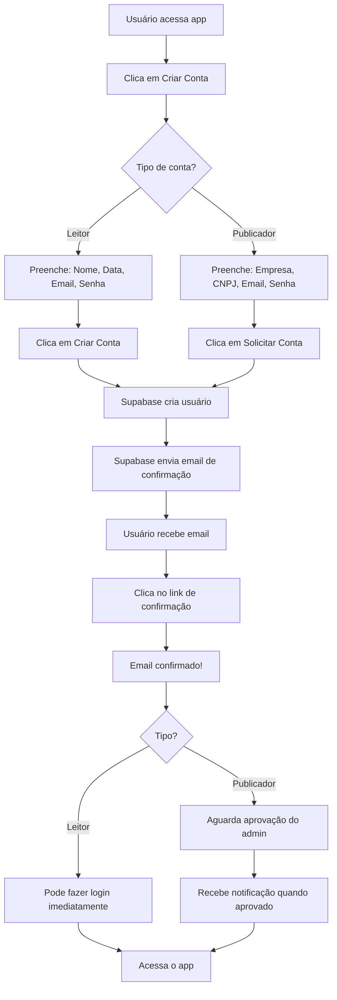

# 🚀 Configurar Sistema Completo - 3 Minutos

## ⚡ Guia Rápido - Faça Tudo de Uma Vez

Este guia configura **TODOS** os recursos necessários para o Pagefy funcionar 100%!

---

## 📋 O Que Será Configurado

1. ✅ Função de reset de senha (`update_user_password`)
2. ✅ Confirmação de email **ATIVA** (segurança)
3. ✅ Sistema de autenticação completo

---

## 🎯 PASSO 1: Executar SQL no Supabase (2 minutos)

### 1.1 Abrir Supabase Dashboard

```
https://supabase.com/dashboard
→ Selecionar seu projeto
```

### 1.2 Executar SQL

```
1. Clicar em "SQL Editor" (📝 na barra lateral)
2. Clicar em "New query"
3. Copiar e colar o SQL abaixo:
```

```sql
-- ═══════════════════════════════════════════════════════════════
-- CONFIGURAÇÃO COMPLETA PAGEFY
-- ═══════════════════════════════════════════════════════════════

-- 1. Habilitar extensão de criptografia
CREATE EXTENSION IF NOT EXISTS pgcrypto;

-- 2. Criar função de reset de senha
CREATE OR REPLACE FUNCTION update_user_password(
  user_email TEXT,
  new_password TEXT
)
RETURNS JSON
LANGUAGE plpgsql
SECURITY DEFINER
AS $$
DECLARE
  user_id UUID;
BEGIN
  -- Buscar usuário
  SELECT id INTO user_id
  FROM auth.users
  WHERE email = user_email;
  
  -- Verificar se existe
  IF user_id IS NULL THEN
    RETURN json_build_object('success', false, 'error', 'Usuário não encontrado');
  END IF;
  
  -- Atualizar senha
  UPDATE auth.users
  SET 
    encrypted_password = crypt(new_password, gen_salt('bf')),
    updated_at = now()
  WHERE id = user_id;
  
  -- Retornar sucesso
  RETURN json_build_object('success', true, 'user_id', user_id);
  
EXCEPTION
  WHEN OTHERS THEN
    RETURN json_build_object('success', false, 'error', SQLERRM);
END;
$$;

-- 3. Dar permissões
GRANT EXECUTE ON FUNCTION update_user_password(TEXT, TEXT) TO authenticated;
GRANT EXECUTE ON FUNCTION update_user_password(TEXT, TEXT) TO anon;

-- 4. Verificação final
SELECT 
  '✅ CONFIGURAÇÃO COMPLETA!' as status,
  (SELECT COUNT(*) FROM auth.users) as total_users,
  (SELECT COUNT(*) FROM information_schema.routines WHERE routine_name = 'update_user_password') as function_created;
```

```
4. Clicar em "RUN" ou pressionar Ctrl+Enter
5. Deve aparecer:
   ✅ CONFIGURAÇÃO COMPLETA!
   total_users: X
   function_created: 1
```

---

## 📧 PASSO 2: Configurar Confirmação de Email (1 minuto)

A confirmação de email está **ATIVA** por padrão no Pagefy, e isso é importante para segurança!

### Como Funciona:

1. **Ao criar conta:**
   - Usuário preenche dados
   - Sistema cria conta no Supabase
   - **Supabase envia email de confirmação automaticamente**

2. **Usuário recebe email:**
   - Deve clicar no link de confirmação
   - Email é confirmado automaticamente
   - Pode fazer login normalmente

3. **Se tentar fazer login sem confirmar:**
   - Sistema mostra mensagem clara
   - "Email não confirmado - verifique sua caixa de entrada"

### ⚙️ Configuração no Supabase (Verificar):

```
1. Ir em: Authentication → Providers → Email
2. Verificar se "Confirm email" está MARCADO ✅
3. Se não estiver, MARCAR
4. Clicar em "Save"
```

### 📬 Template de Email (Opcional):

Para personalizar o email de confirmação:

```
1. Ir em: Authentication → Email Templates
2. Selecionar "Confirm signup"
3. Personalizar mensagem
4. Salvar
```

---

## ✅ PASSO 3: Testar Sistema (3 minutos)

### Teste 1: Cadastro (1 min)

```
1. Ir para o app
2. Clicar em "Criar conta"
3. Escolher "Leitor"
4. Preencher:
   Nome: João Teste
   Data de Nascimento: 2000-01-15
   Email: seu_email_real@gmail.com (use seu email real!)
   Senha: 123456
   Confirmar: 123456
5. Clicar em "Criar Conta"

✅ Conta criada!
⚠️ Você receberá um email de confirmação
```

### Teste 2: Confirmar Email (30 seg)

```
1. Abrir sua caixa de email
2. Procurar email do Supabase
3. Clicar no link "Confirm your email"

✅ Email confirmado!
```

### Teste 3: Fazer Login (30 seg)

```
1. Voltar ao app
2. Fazer login com:
   Email: seu_email_real@gmail.com
   Senha: 123456

✅ Login funcionando!
```

### Teste 4: Recuperação de Senha (1 min)

```
1. Fazer logout
2. Clicar em "Esqueci minha senha"
3. Preencher:
   Email: seu_email_real@gmail.com
   Nome Completo: João Teste
   Data de Nascimento: 2000-01-15
   Nova Senha: nova123
   Confirmar: nova123
4. Clicar em "Redefinir Senha"

✅ Senha redefinida com sucesso!
```

### Teste 5: Login com Nova Senha (30 seg)

```
1. Fazer login com:
   Email: seu_email_real@gmail.com
   Senha: nova123

✅ Tudo funcionando!
```

---

## 🎉 Resultado Final

Se todos os testes funcionaram:

```
✅ Cadastro funcionando
✅ Email de confirmação enviado automaticamente
✅ Confirmação de email funcionando
✅ Login apenas com email confirmado
✅ Recuperação de senha funcionando
✅ Sistema 100% operacional e seguro
```

---

## 🔍 Verificações SQL

### Ver usuários e status de confirmação:

```sql
SELECT 
  email,
  email_confirmed_at,
  created_at,
  CASE 
    WHEN email_confirmed_at IS NOT NULL THEN '✅ Confirmado'
    ELSE '⏳ Pendente'
  END as status
FROM auth.users
ORDER BY created_at DESC
LIMIT 10;
```

### Ver perfis:

```sql
SELECT 
  name,
  email,
  birth_date,
  role,
  is_locked,
  created_at
FROM profiles
ORDER BY created_at DESC
LIMIT 10;
```

### Testar função de reset:

```sql
SELECT update_user_password('seu@email.com', 'teste123');
```

Deve retornar:
```json
{"success": true, "user_id": "uuid"}
```

---

## ❌ Solução de Problemas

### Erro: "Email not confirmed" no login

**Isso é esperado!** Significa que o sistema está funcionando corretamente.

**Solução:**
1. Verifique sua caixa de entrada
2. Procure email do Supabase
3. Clique no link de confirmação
4. Tente fazer login novamente

**Se não recebeu o email:**
```sql
-- Reenviar email de confirmação manualmente
-- (Executar no SQL Editor do Supabase)
UPDATE auth.users 
SET confirmation_sent_at = NOW()
WHERE email = 'seu@email.com';
```

**Para desenvolvimento/testes (NÃO recomendado para produção):**
```sql
-- Confirmar email manualmente (APENAS PARA TESTES)
UPDATE auth.users 
SET 
  email_confirmed_at = NOW(),
  confirmed_at = NOW()
WHERE email = 'seu@email.com';
```

### Erro: "function does not exist"

**Solução:**
```sql
-- Verificar se função existe
SELECT routine_name 
FROM information_schema.routines 
WHERE routine_name = 'update_user_password';

-- Se não retornar nada, executar novamente a parte da função SQL acima
```

### Erro: Email não está chegando

**Soluções:**

1. **Verificar spam/lixo eletrônico**
2. **Verificar configuração do Supabase:**
   ```
   Authentication → Email Templates → Verify email is enabled
   ```
3. **Usar email de teste do Supabase:**
   ```
   Authentication → Settings → SMTP Settings
   (Por padrão usa SMTP do Supabase)
   ```

---

## 🔒 Segurança: Por Que Manter Confirmação Ativa?

✅ **Vantagens:**
- Previne cadastros com emails falsos
- Confirma que o usuário tem acesso ao email
- Protege contra spam e contas falsas
- Aumenta qualidade da base de usuários

❌ **Desabilitar confirmação:**
- Permite cadastros com qualquer email
- Pode gerar problemas de recuperação de senha
- Menos seguro para produção

---

## 📊 Checklist Completo

### Supabase Dashboard:
- [ ] SQL Editor aberto
- [ ] SQL colado e executado
- [ ] Visto "✅ CONFIGURAÇÃO COMPLETA!"
- [ ] Authentication → Providers → Email → "Confirm email" MARCADO ✅

### Testes:
- [ ] Cadastro de usuário com email real
- [ ] Email de confirmação recebido
- [ ] Link de confirmação clicado
- [ ] Login bem-sucedido
- [ ] Logout funcionando
- [ ] Recuperação de senha testada
- [ ] Login com nova senha funcionando
- [ ] Tudo operacional ✅

---

## 🎯 Fluxo Completo de Cadastro



---

## 📁 Documentação Relacionada

- `/URGENTE_EXECUTAR_SQL.md` - Apenas a função SQL
- `/FIX_EMAIL_CONFIRMATION.md` - Detalhes sobre confirmação de email
- `/RESUMO_FINAL_CORRECOES.md` - Resumo técnico completo
- `/STATUS_SISTEMA.md` - Status geral do sistema

---

## 🆘 Suporte

**Problemas comuns:**
- Ver console do navegador (F12)
- Verificar logs com `[Auth]`, `[SignupForm]`, etc.
- Consultar arquivos de documentação acima

---

**Tempo total:** 3-5 minutos  
**Dificuldade:** Fácil  
**Resultado:** Sistema 100% funcional e seguro 🚀

---

## 🎉 TL;DR (Resumão)

1. **Supabase:**
   - SQL Editor → Copiar SQL → Executar → Ver "✅ CONFIGURAÇÃO COMPLETA!"
   - Authentication → Providers → Email → Verificar "Confirm email" está MARCADO

2. **Testar:**
   - Criar conta com email real → Receber email → Confirmar → Login

3. **Pronto! 🎉**

Sistema funcionando com segurança total em 3 minutos!
